# Пояснительная записка к выпускной квалификационной работе

## Краткое резюме

В выпускной квалификационной работе разработано веб-приложение `Workout Planner / workout-tracker` для планирования, проведения и учета персональных тренировок. Приложение позволяет работать с каталогом упражнений, создавать собственные упражнения, собирать тренировки, запускать их в пошаговом режиме с таймерами и звуковыми сигналами, сохранять историю занятий и просматривать базовый прогресс.

Система реализована как статическое браузерное приложение. Это означает, что для запуска не требуется серверная часть, база данных или учетная запись. Пользовательские данные сохраняются локально в браузере, а основной интерфейс может открываться без сети после первого успешного запуска благодаря service worker и механизму кеширования app shell.

Проект имеет модульную архитектуру: доменная логика вынесена в `features`, хранилище - в `storage`, движок активной тренировки - в `session`, рендеринг экранов - в `pages`, а обработчики пользовательских действий - в `ui`. Ключевые части приложения покрыты автоматическими тестами: хранилище, рекомендации, генерация тренировок, движок сессии, PWA-кеш и e2e smoke-сценарии.

## Как читать этот документ

Документ построен от общего к частному. Разделы 1-5 объясняют предметную область, цель и требования. Разделы 6-13 описывают технические решения и реализацию. Раздел 14 фиксирует подход к тестированию и фактические показатели покрытия. Разделы 15-17 описывают ограничения, безопасность, развитие и итог работы.


## Оглавление

1. [Введение](#1-введение)
2. [Актуальность темы](#2-актуальность-темы)
3. [Цель и задачи проекта](#3-цель-и-задачи-проекта)
4. [Анализ предметной области](#4-анализ-предметной-области)
5. [Требования к системе](#5-требования-к-системе)
6. [Выбор технологий](#6-выбор-технологий)
7. [Проектирование архитектуры](#7-проектирование-архитектуры)
8. [Модель данных](#8-модель-данных)
9. [Реализация пользовательского интерфейса](#9-реализация-пользовательского-интерфейса)
10. [Реализация конструктора тренировок](#10-реализация-конструктора-тренировок)
11. [Реализация сессии тренировки и таймеров](#11-реализация-сессии-тренировки-и-таймеров)
12. [Реализация истории и прогресса](#12-реализация-истории-и-прогресса)
13. [Реализация PWA и offline-режима](#13-реализация-pwa-и-offline-режима)
14. [Тестирование](#14-тестирование)
15. [Безопасность и ограничения](#15-безопасность-и-ограничения)
16. [Перспективы развития](#16-перспективы-развития)
17. [Заключение](#17-заключение)

## 1. Введение

Темой выпускной квалификационной работы является разработка веб-приложения `Workout Planner / workout-tracker`, предназначенного для планирования персональных тренировок, работы с каталогом упражнений, запуска пошаговой тренировочной сессии, ведения истории занятий и просмотра базового прогресса.

Приложение работает в браузере как статический сайт. Серверная часть для хранения данных и выполнения бизнес-логики не используется. Такой подход выбран осознанно: основная задача проекта состоит в создании автономного пользовательского инструмента, который можно открыть локально или разместить на статическом хостинге.

Для хранения данных используется **local-first подход**: профиль, тренировки, пользовательские упражнения, история и настройки сохраняются в браузере пользователя. Для запуска приложения после первого открытия без сети используется **Progressive Web App** механизм, включающий web manifest, service worker и кеширование app shell.

Разработка выполнена с учетом технического задания, в котором определены ключевые сценарии:

- просмотр каталога упражнений;
- создание пользовательских упражнений;
- составление и редактирование тренировок;
- запуск тренировки с таймерами и звуковыми сигналами;
- сохранение результатов;
- отображение календаря активности;
- локальное хранение данных;
- импорт и экспорт пользовательских данных;
- поддержка светлой и темной темы;
- поддержка русского и английского языков интерфейса.

В рамках работы была создана модульная структура приложения. Доменная логика вынесена в отдельные JavaScript-модули, UI-слой отделен от расчетов и хранилища, а наиболее важные части системы покрыты автоматическими тестами. Проект также содержит документацию для пользователя и разработчика, описание архитектуры, модели данных, PWA-режима, хранилища, движка тренировочной сессии и тестирования.

## 2. Актуальность темы

Регулярная физическая активность требует удобной организации тренировочного процесса. Пользователю необходимо хранить список упражнений, составлять тренировки под свои цели и доступное оборудование, отслеживать историю занятий, возвращаться к прошлым результатам и выполнять тренировку в понятном пошаговом режиме. Без цифрового инструмента такие задачи часто решаются разрозненно: упражнения записываются в заметках, таймер запускается отдельно, история ведется вручную, а прогресс не агрегируется.

Существующие фитнес-приложения часто зависят от серверной инфраструктуры, учетной записи и сетевого подключения. Для учебного и портфолио-проекта была выбрана другая модель: приложение должно работать локально, быть простым для запуска и не требовать передачи персональных данных на сервер. Такой подход особенно актуален для задач, где пользователь хочет контролировать свои данные и использовать приложение на одном устройстве без обязательной регистрации.

Дополнительную актуальность задает необходимость поддержки офлайн-сценариев. Тренировка может проводиться в спортзале, дома или другом месте, где связь нестабильна. Поэтому приложение должно быть способно открыть основной интерфейс без сети после первого запуска, сохранить активную сессию и не потерять данные при перезагрузке страницы.

Проект также актуален как инженерная задача. Он объединяет несколько прикладных областей: проектирование модели данных, управление локальным хранилищем, реализацию таймеров и восстановимого состояния, генерацию рекомендаций, адаптивный пользовательский интерфейс, PWA-механику и автоматизированное тестирование. Это позволяет продемонстрировать не только создание интерфейса, но и полноценную архитектурную проработку browser-first приложения.

## 3. Цель и задачи проекта

Цель проекта - разработать веб-приложение для планирования, проведения и учета персональных тренировок, работающее как статическое PWA-приложение с локальным хранением пользовательских данных.

### 3.1. Задачи проекта

Для достижения цели были поставлены следующие задачи:

1. Разработать каталог упражнений с поддержкой встроенных и пользовательских записей.
2. Реализовать поиск, фильтрацию, избранное и просмотр подробной информации об упражнении.
3. Спроектировать модель тренировки, состоящей из упорядоченного списка упражнений с подходами, повторами или длительностью, отдыхом и заметками.
4. Реализовать создание, редактирование, просмотр, дублирование и удаление тренировок.
5. Реализовать генерацию одной тренировки на основе профиля пользователя, целей, длительности, оборудования, противопоказаний и системы рекомендаций.
6. Реализовать пошаговый запуск тренировки с таймером, фазами выполнения, отдыхом, паузой, продолжением, пропуском шага и изменением времени.
7. Реализовать звуковые сигналы для событий тренировочной сессии и поддержку пользовательских аудиофайлов.
8. Реализовать сохранение истории выполненных и прерванных тренировок, базовую статистику и календарь активности.
9. Реализовать локальное хранилище на базе `localStorage`, включая нормализацию данных, миграции, импорт и экспорт JSON.
10. Реализовать настройки профиля, оборудования, интерфейса, языка, темы, плотности отображения и звука.
11. Реализовать PWA-возможности: manifest, service worker, app shell precache и офлайн-запуск после первого открытия.
12. Разработать набор автоматических тестов для ключевых модулей: хранилища, рекомендаций, генерации тренировок, движка сессии, PWA и e2e-сценариев.
13. Подготовить техническую документацию, описывающую архитектуру, модель данных, хранилище, PWA-режим и процесс разработки.

### 3.2. Критерии выполнения

| Критерий | Статус в проекте |
| --- | --- |
| Каталог встроенных упражнений | Реализован через `data/exercises.json` и `js/features/exercises-data.js`. |
| Пользовательские упражнения | Реализованы через `customExercises` и формы UI. |
| Конструктор тренировок | Реализован через workout-модель, репозиторий и page-renderers. |
| Редактирование, дублирование и удаление тренировок | Реализовано в storage и UI-actions. |
| Пошаговая тренировка с таймерами | Реализована в `js/session/`. |
| Пауза, продолжение, пропуск, изменение времени | Реализовано в `WorkoutSession`. |
| История и календарная активность | Реализовано через `history` и `js/features/history.js`. |
| Локальное хранение и миграции | Реализовано в `js/storage/`. |
| Импорт и экспорт JSON | Реализовано через `exportStore()` и `importStore()`. |
| PWA и офлайн app shell | Реализовано через `manifest.webmanifest`, `sw.js` и precache. |
| Автоматические тесты | Реализованы в `tests/`; фактические показатели приведены в разделе 14. |

## 4. Анализ предметной области

Предметная область проекта связана с индивидуальным планированием тренировок. В ней можно выделить несколько базовых сущностей: упражнение, тренировка, элемент тренировки, тренировочная сессия, запись истории, пользовательский профиль, оборудование и настройки.

### 4.1. Упражнение

Упражнение является справочной единицей. Оно описывает конкретное движение или активность: название, краткое описание, инструкцию, эффект, тип выполнения, задействованные мышцы, теги, противопоказания, сложность, оборудование и расчетный расход калорий. В проекте поддерживаются разные режимы выполнения: по повторениям, по времени, удержание и пользовательский режим. Для упражнений по повторениям может использоваться темп, который разбивает повторение на фазы движения.

### 4.2. Тренировка

Тренировка представляет собой шаблон, составленный из упражнений. В отличие от упражнения, тренировка описывает не справочник, а пользовательский план: какие упражнения выполнять, в каком порядке, сколько подходов, сколько повторений или секунд, какой отдых использовать между подходами и между упражнениями. Такое разделение важно, потому что одно и то же упражнение может использоваться в разных тренировках с разными параметрами.

### 4.3. Тренировочная сессия

Тренировочная сессия является фактическим процессом выполнения тренировки. Она отличается от шаблона тем, что содержит динамическое состояние: текущий шаг, оставшееся время, прогресс, статус, паузу, завершение или прерывание. Для корректной работы сессии нужно уметь преобразовывать шаблон тренировки в последовательность шагов: упражнение, отдых между подходами, отдых между упражнениями.

### 4.4. История и прогресс

История тренировки фиксирует результат выполнения. Она хранится отдельно от шаблона, потому что пользователь может изменить или удалить тренировку после прохождения, но запись о прошлом занятии должна сохранять снимок названия, время начала и завершения, длительность, статус, заметку, оценку, число выполненных упражнений и подходов.

### 4.5. Профиль и оборудование

Профиль пользователя влияет на рекомендации. В текущей реализации он включает антропометрию, уровень подготовки, цели, фокус тела, ограничения, нежелательные упражнения, предпочитаемые теги, желаемую длительность тренировки, частоту и профиль восстановления. Эти данные не отправляются на сервер и используются локально для подбора упражнений.

Оборудование также является важным фактором. Упражнение может требовать гантели, турник, тренажеры, эспандеры или другое оборудование. Если оборудование недоступно, такое упражнение не должно попадать в рекомендации или автоматически сгенерированную тренировку. Упражнения с собственным весом рассматриваются как базово доступные.


## 5. Требования к системе

Требования были сформированы на основе технического задания и фактической реализации проекта.

### 5.1. Функциональные требования MVP

| Требование | Реализация |
| --- | --- |
| Отображение каталога встроенных упражнений | `js/features/exercises.js`, generated data. |
| Создание пользовательских упражнений | `customExercises`, формы и storage API. |
| Поиск и фильтрация упражнений | UI каталога и фильтры. |
| Избранные упражнения | `settings.favoriteExerciseIds`. |
| Создание и редактирование тренировок | workout renderers, actions, repository. |
| Дублирование и удаление тренировок | `workoutRepository.js`, UI-actions. |
| Запуск тренировки | `#workout-run/<id>`, `js/session/`. |
| Таймеры упражнений и отдыха | `WorkoutSession`, `buildWorkoutSteps`. |
| Пауза, продолжение, пропуск, изменение времени | Методы `pause`, `resume`, `skipCurrentStep`, `addTime`, `subtractTime`. |
| История тренировок | `historyRepository.js`, `js/features/history.js`. |
| Календарь активности и статистика | `calendar.js`, `home-stats.js`, history aggregation. |
| Настройки языка, темы, звука | `settings`, `i18n`, UI settings. |
| Импорт и экспорт JSON | `exportStore`, `importStore`. |
| Восстановление активной сессии | `activeSession`, `snapshot.js`. |
| PWA-офлайн app shell | `manifest.webmanifest`, `sw.js`. |

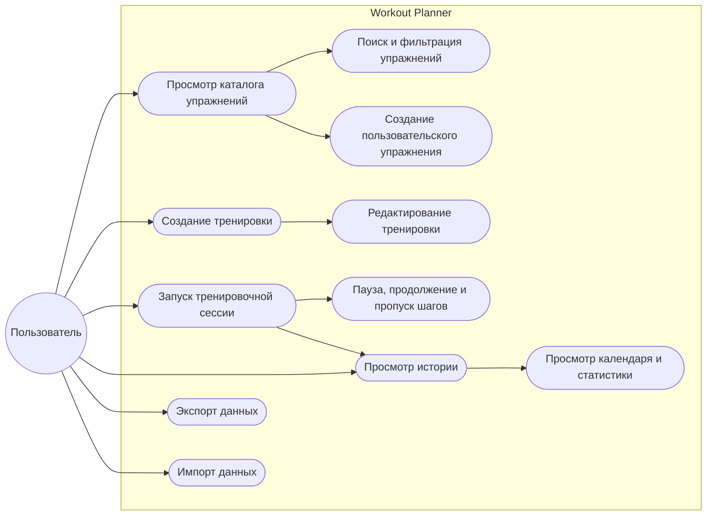
```mermaid
%% Диаграмма вариантов использования: функциональные требования MVP
flowchart LR
  user(("Пользователь"))

  subgraph app["Workout Planner"]
    exercises(["Просмотр каталога упражнений"])
    filters(["Поиск и фильтрация упражнений"])
    customExercise(["Создание пользовательского упражнения"])
    workoutCreate(["Создание тренировки"])
    workoutEdit(["Редактирование тренировки"])
    sessionRun(["Запуск тренировочной сессии"])
    sessionControl(["Пауза, продолжение и пропуск шагов"])
    history(["Просмотр истории"])
    progress(["Просмотр календаря и статистики"])
    dataExport(["Экспорт данных"])
    dataImport(["Импорт данных"])
  end

  user --> exercises
  user --> workoutCreate
  user --> sessionRun
  user --> history
  user --> dataExport
  user --> dataImport

  exercises --> filters
  exercises --> customExercise
  workoutCreate --> workoutEdit
  sessionRun --> sessionControl
  sessionRun --> history
  history --> progress
```

Рисунок 1 - Диаграмма вариантов использования MVP.

### 5.2. Дополнительные реализованные требования

| Требование | Реализация |
| --- | --- |
| Профиль пользователя для рекомендаций | `profile`, `settings-renderers`, `profileRepository.js`. |
| Выбор и добавление оборудования | `equipment`, `equipment.js`, `profileRepository.js`. |
| Рекомендации упражнений | `recommendations.js`. |
| Генерация одной тренировки | `workout-generation.js`. |
| Миграции хранилища | `migrations.js`. |
| Проверка service worker precache | `tests/pwa/service-worker.test.js`. |

### 5.3. Требования будущего развития

Некоторые пункты технического задания лучше рассматривать как развитие после базовой версии:

- сложные суперсеты;
- расширенная аналитика;
- продвинутый аудиоредактор;
- детальный учет веса и инвентаря в рамках подходов;
- синхронизация между устройствами;
- более сложная периодизация тренировок;
- расширенные подтверждения и draft-сценарии во всех формах.

### 5.4. Нефункциональные требования

- приложение должно работать как статический сайт;
- приложение не должно требовать backend API;
- пользовательские данные должны храниться локально;
- интерфейс должен быть пригоден для современных браузеров;
- приложение должно использовать модульную структуру кода;
- ошибки и поврежденные данные в хранилище должны обрабатываться через безопасные fallback-механизмы;
- изменения схемы данных должны поддерживаться миграциями;
- ключевая бизнес-логика должна быть покрыта автоматическими тестами;
- PWA app shell должен проверяться на полноту precache-списка;
- проект должен поддерживать воспроизводимую разработку через `npm ci` и набор npm-скриптов.

## 6. Выбор технологий

### 6.1. HTML, CSS и JavaScript без фреймворка

Для реализации был выбран стек HTML, CSS и JavaScript ES Modules без фронтенд-фреймворка. Такой выбор соответствует техническому ограничению проекта и позволяет показать понимание базовых механизмов браузера: DOM, событий, модулей, локального хранилища, service worker и Web APIs.

**Почему без фреймворка:** приложение является учебным и портфолио-проектом с ограниченным набором экранов. Использование нативных возможностей браузера снижает количество зависимостей, упрощает статическое размещение, делает сборку необязательной и позволяет лучше контролировать архитектурные границы. Недостаток такого подхода - необходимость вручную поддерживать рендеринг, состояние и обработчики событий, что требует строгой модульной организации.

### 6.2. Local-first хранение

`localStorage` выбран как основное хранилище пользовательских данных. Он подходит для local-first приложения без backend. Хранилище не требует настройки сервера и доступно во всех современных браузерах. Для компенсации ограничений `localStorage` в проекте реализованы схема данных, санитайзеры, миграции и импорт/экспорт.

### 6.3. Hash routing

Hash routing выбран вместо History API, потому что приложение является статическим и должно работать без серверных rewrite-правил. Маршруты вида `#home`, `#exercises`, `#workout-create` и `#workout-run/<id>` обрабатываются на стороне клиента, а сервер всегда отдает один и тот же статический app shell.

### 6.4. PWA

PWA-технологии выбраны для поддержки офлайн-сценариев. `manifest.webmanifest` описывает приложение, иконки, режим отображения и shortcuts. `sw.js` кеширует app shell и позволяет открыть приложение без сети после первого запуска. Для поддержания актуальности кеша используется скрипт генерации precache-списка.

### 6.5. Инструменты качества

Для качества кода применяются Jest, Playwright, ESLint и Prettier. Jest используется для модульных и интеграционных тестов, Playwright - для e2e smoke-сценариев, ESLint - для статического анализа, Prettier - для единообразного форматирования. CI настроен через GitHub Actions.

## 7. Проектирование архитектуры

### 7.1. Общая схема

Архитектура проекта построена по принципу разделения ответственности. Приложение не использует framework-level runtime, поэтому границы модулей определены явно.

```text
Browser
  |
  v
index.html
  |
  v
js/app.js
  |
  +--> js/core/
  |      router, state, selectors, pwa, utils
  |
  +--> js/ui/
  |      shell, actions, event bindings, notices
  |
  +--> js/pages/
  |      page renderers and reusable page components
  |
  +--> js/features/
  |      exercises, recommendations, workouts, history, audio
  |
  +--> js/session/
  |      workout steps, timer controller, snapshot recovery
  |
  +--> js/storage/
         schema, records, migrations, repositories, localStorage facade
```

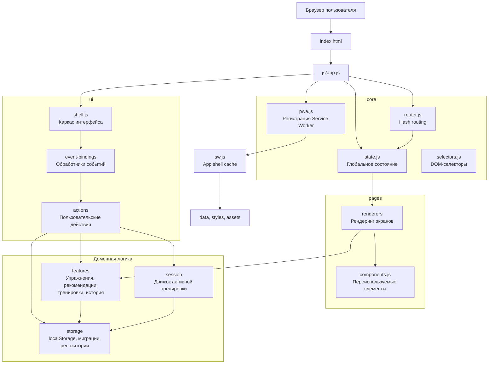
```mermaid
%% Общая архитектура приложения
flowchart TD
  browser["Браузер пользователя"]
  index["index.html"]
  app["js/app.js"]

  subgraph core["core"]
    router["router.js\nHash routing"]
    state["state.js\nГлобальное состояние"]
    pwa["pwa.js\nРегистрация Service Worker"]
    selectors["selectors.js\nDOM-селекторы"]
  end

  subgraph ui["ui"]
    shell["shell.js\nКаркас интерфейса"]
    bindings["event-bindings\nОбработчики событий"]
    actions["actions\nПользовательские действия"]
  end

  subgraph pages["pages"]
    renderers["renderers\nРендеринг экранов"]
    components["components.js\nПереиспользуемые элементы"]
  end

  subgraph domain["Доменная логика"]
    features["features\nУпражнения, рекомендации,\nтренировки, история"]
    session["session\nДвижок активной тренировки"]
    storage["storage\nlocalStorage, миграции,\nрепозитории"]
  end

  assets["data, styles, assets"]
  sw["sw.js\nApp shell cache"]

  browser --> index --> app
  app --> pwa
  app --> shell
  app --> router
  app --> state
  state --> renderers
  router --> state
  shell --> bindings
  bindings --> actions
  actions --> features
  actions --> session
  actions --> storage
  renderers --> components
  renderers --> features
  features --> storage
  session --> storage
  pwa --> sw
  sw --> assets
```

Рисунок 2 - Общая архитектура приложения.

### 7.2. Поток запуска

Общий поток запуска следующий:

1. `index.html` загружает `js/app.js`.
2. `js/app.js` регистрирует service worker через `js/core/pwa.js`.
3. Инициализируется shell-интерфейс.
4. Рендер приложения подписывается на изменения состояния.
5. Загружается встроенный каталог упражнений.
6. Запускается hash-router.

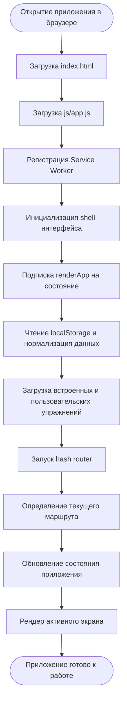
```mermaid
%% Поток запуска приложения
flowchart TD
  start([Открытие приложения в браузере])
  loadIndex["Загрузка index.html"]
  loadApp["Загрузка js/app.js"]
  registerPwa["Регистрация Service Worker"]
  initShell["Инициализация shell-интерфейса"]
  subscribeRender["Подписка renderApp на состояние"]
  loadStore["Чтение localStorage и нормализация данных"]
  loadExercises["Загрузка встроенных и пользовательских упражнений"]
  startRouter["Запуск hash router"]
  resolveRoute["Определение текущего маршрута"]
  updateState["Обновление состояния приложения"]
  renderPage["Рендер активного экрана"]
  ready([Приложение готово к работе])

  start --> loadIndex --> loadApp --> registerPwa --> initShell
  initShell --> subscribeRender --> loadStore --> loadExercises
  loadExercises --> startRouter --> resolveRoute --> updateState --> renderPage --> ready
```

Рисунок 3 - Поток запуска приложения.

### 7.3. Слои приложения

Слой `js/core/` содержит базовые механизмы приложения. В нем находятся роутер, состояние, PWA-регистрация, селекторы и общие утилиты. Роутер читает `window.location.hash`, нормализует route и параметры, после чего обновляет состояние приложения.

Слой `js/features/` содержит бизнес-логику предметной области. В него входят модули упражнений, оборудования, противопоказаний, совместимости упражнений с профилем, рекомендаций, генерации тренировок, нормализации тренировок, истории, пресетов и аудио.

Слой `js/storage/` отвечает за persistency. Он содержит схему, дефолтные значения, фабрики записей, санитайзеры, миграции, низкоуровневую работу с `localStorage`, репозитории и публичный фасад.

Слой `js/session/` реализует движок активной тренировки. Он строит шаги из тренировки, управляет таймером, статусами, фазами, звуковыми событиями, callbacks и сохранением snapshot.

Слой `js/pages/` содержит рендереры страниц и переиспользуемые компоненты экранов. Слой `js/ui/` связывает пользовательские действия с состоянием и доменной логикой.

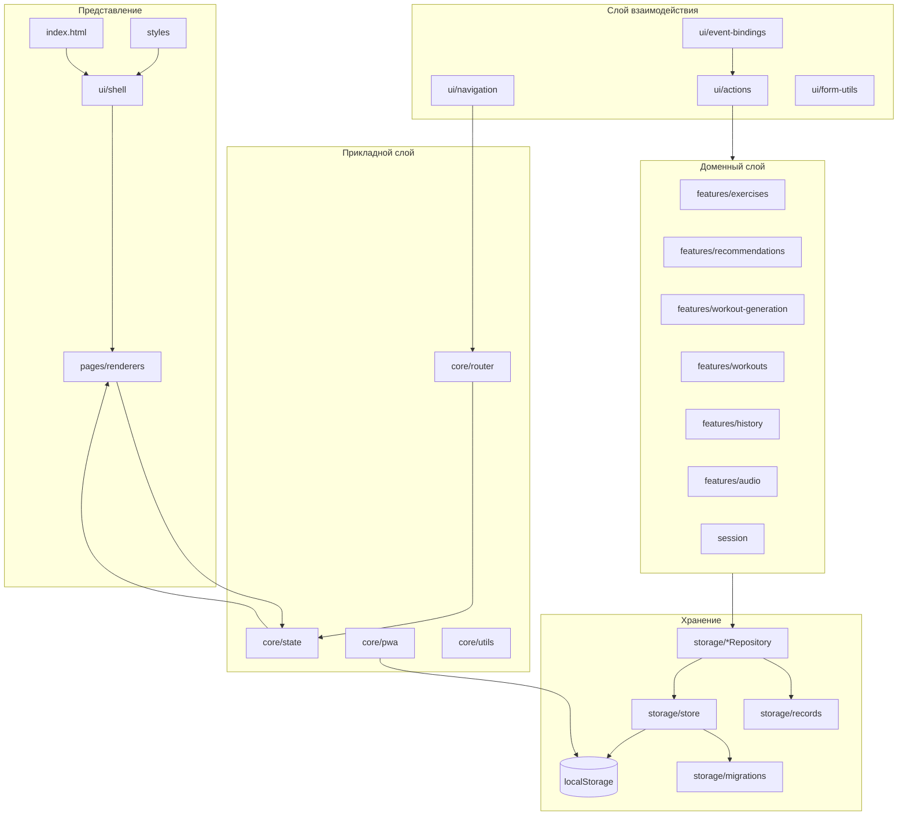
```mermaid
%% Диаграмма слоев и модулей
flowchart TB
  subgraph presentation["Представление"]
    html["index.html"]
    css["styles"]
    shell["ui/shell"]
    pages["pages/renderers"]
  end

  subgraph interaction["Слой взаимодействия"]
    nav["ui/navigation"]
    eventBindings["ui/event-bindings"]
    actions["ui/actions"]
    formUtils["ui/form-utils"]
  end

  subgraph application["Прикладной слой"]
    state["core/state"]
    router["core/router"]
    pwa["core/pwa"]
    utils["core/utils"]
  end

  subgraph domain["Доменный слой"]
    exercises["features/exercises"]
    recommendations["features/recommendations"]
    generation["features/workout-generation"]
    workouts["features/workouts"]
    history["features/history"]
    audio["features/audio"]
    session["session"]
  end

  subgraph persistence["Хранение"]
    repositories["storage/*Repository"]
    store["storage/store"]
    records["storage/records"]
    migrations["storage/migrations"]
    localStorage[("localStorage")]
  end

  html --> shell
  css --> shell
  shell --> pages
  pages --> state
  nav --> router
  eventBindings --> actions
  actions --> domain
  router --> state
  state --> pages
  pwa --> localStorage
  domain --> repositories
  repositories --> records
  repositories --> store
  store --> migrations
  store --> localStorage
```

Рисунок 4 - Диаграмма слоев и модулей приложения.

### 7.4. Поддерживаемые маршруты

| Route | Экран |
| --- | --- |
| `#home` | Главная страница. |
| `#exercises` | Каталог упражнений. |
| `#recommendations` | Рекомендации упражнений. |
| `#exercise-create` | Создание упражнения. |
| `#exercise-view/<id>` | Просмотр упражнения. |
| `#exercise-edit/<id>` | Редактирование пользовательского упражнения. |
| `#workout-create` | Конструктор тренировки. |
| `#workout-generate` | Генератор тренировки. |
| `#workout-view` | Список тренировок. |
| `#workout-view/<id>` | Детали тренировки. |
| `#workout-edit/<id>` | Редактирование тренировки. |
| `#workout-run/<id>` | Активная тренировочная сессия. |
| `#settings` | Настройки. |

## 8. Модель данных

### 8.1. Общая структура `localStorage`

Основная модель данных хранится в `localStorage` под ключом `workout-tracker:data`. Текущая версия схемы - `6`.

```js
{
  version: 6,
  settings: {},
  profile: {},
  equipment: {},
  customExercises: [],
  workouts: [],
  history: [],
  activeSession: null
}
```

Раздел `settings` хранит пользовательские настройки: язык, тему, плотность интерфейса, состояние звука, громкость, пользовательские аудиофайлы, избранные упражнения, режим календаря и ID последней открытой тренировки.

Раздел `profile` описывает пользователя и параметры, влияющие на рекомендации: антропометрию, уровень подготовки, цели, фокус тела, ограничения, нелюбимые упражнения, понравившиеся теги, желаемую длительность тренировки, частоту занятий, профиль восстановления и недавнюю историю.

Раздел `equipment` хранит выбранное оборудование и пользовательские элементы оборудования. Это позволяет рекомендациям и генератору тренировки учитывать реальные условия пользователя.

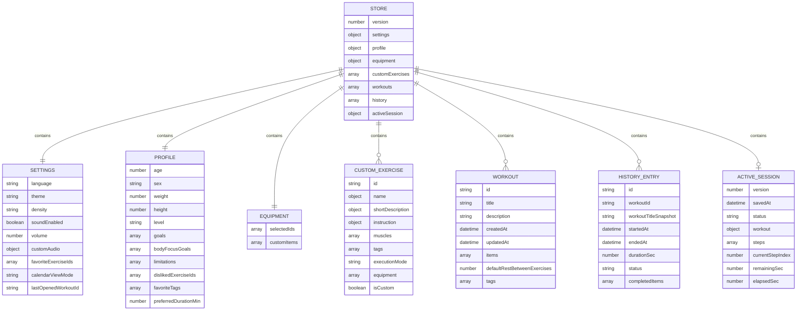
```mermaid
%% Модель данных localStorage
erDiagram
  STORE {
    number version
    object settings
    object profile
    object equipment
    array customExercises
    array workouts
    array history
    object activeSession
  }

  SETTINGS {
    string language
    string theme
    string density
    boolean soundEnabled
    number volume
    object customAudio
    array favoriteExerciseIds
    string calendarViewMode
    string lastOpenedWorkoutId
  }

  PROFILE {
    number age
    string sex
    number weight
    number height
    string level
    array goals
    array bodyFocusGoals
    array limitations
    array dislikedExerciseIds
    array favoriteTags
    number preferredDurationMin
  }

  EQUIPMENT {
    array selectedIds
    array customItems
  }

  CUSTOM_EXERCISE {
    string id
    object name
    object shortDescription
    object instruction
    array muscles
    array tags
    string executionMode
    array equipment
    boolean isCustom
  }

  WORKOUT {
    string id
    string title
    string description
    datetime createdAt
    datetime updatedAt
    array items
    number defaultRestBetweenExercises
    array tags
  }

  HISTORY_ENTRY {
    string id
    string workoutId
    string workoutTitleSnapshot
    datetime startedAt
    datetime endedAt
    number durationSec
    string status
    array completedItems
  }

  ACTIVE_SESSION {
    number version
    datetime savedAt
    string status
    object workout
    array steps
    number currentStepIndex
    number remainingSec
    number elapsedSec
  }

  STORE ||--|| SETTINGS : contains
  STORE ||--|| PROFILE : contains
  STORE ||--|| EQUIPMENT : contains
  STORE ||--o{ CUSTOM_EXERCISE : contains
  STORE ||--o{ WORKOUT : contains
  STORE ||--o{ HISTORY_ENTRY : contains
  STORE ||--o| ACTIVE_SESSION : contains
```

Рисунок 5 - Модель данных, сохраняемая в `localStorage`.

### 8.2. Упражнение

Упражнение в runtime-форме содержит ID, локализованные название и тексты, тип, мышцы, теги, режим выполнения, темп, расчетные калории, изображение, паттерны движения, группы мышц, сложность, оборудование, противопоказания, интенсивность и флаг пользовательского упражнения.

Встроенные упражнения хранятся в исходной JSON-модели в `data/exercises.json`, а для браузера генерируется ES-модуль `js/features/exercises-data.js`. При загрузке `js/features/exercises.js` нормализует встроенные и пользовательские упражнения к единой runtime-форме.

### 8.3. Тренировка и элемент тренировки

Тренировка содержит ID, название, описание, даты создания и обновления, признак preset, список элементов, отдых между упражнениями по умолчанию, цвет темы и теги.

```js
{
  id: 'workout-...',
  title: 'Домашняя тренировка',
  description: '',
  items: [
    {
      id: 'workout-item-...',
      exerciseId: 'push-up',
      sets: 3,
      reps: 12,
      durationSec: null,
      restBetweenSetsSec: 60,
      restAfterExerciseSec: 90,
      tempoOverride: null,
      notes: '',
      order: 0
    }
  ],
  defaultRestBetweenExercises: 90
}
```

Для сохранения тренировки используется валидация. Название не должно быть пустым, список упражнений не должен быть пустым, каждый элемент должен содержать ID упражнения и ровно один основной параметр выполнения: положительные повторы или положительную длительность.

### 8.4. История и активная сессия

Запись истории содержит ID, даты создания и обновления, ID тренировки, снимок названия тренировки, время начала и окончания, длительность, статус, выполненные элементы, заметку, emoji-оценку, расчетные калории, количество выполненных упражнений и подходов.

Активная сессия хранится в сокращенной форме. В `activeSession` записываются версия snapshot, дата сохранения, статус `running` или `paused`, нормализованная тренировка, список ID шагов и их длительностей, индекс текущего шага, оставшееся и прошедшее время, а также время старта.

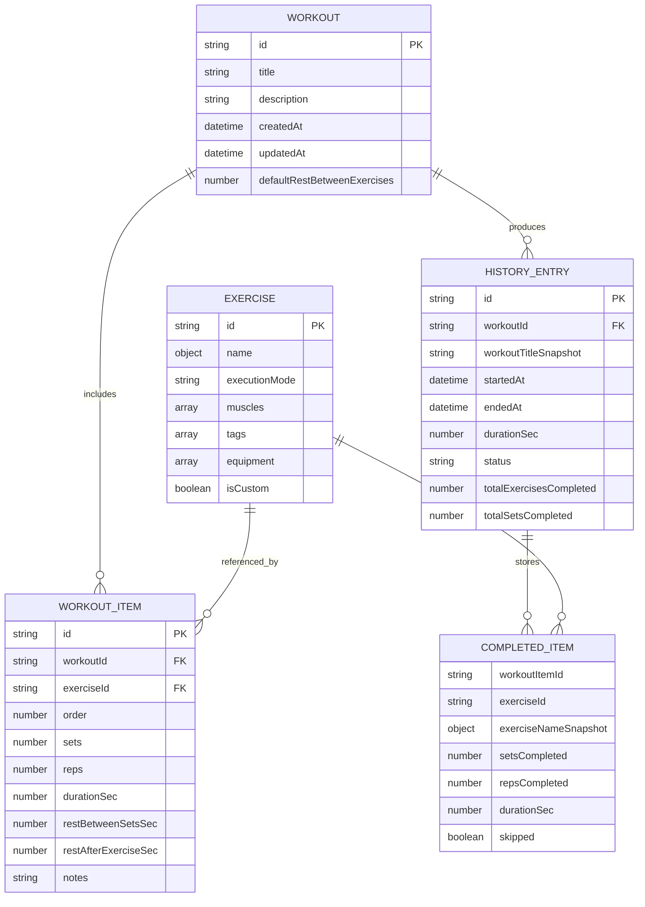
```mermaid
%% Связь сущностей: Exercise, Workout, WorkoutItem, HistoryEntry
erDiagram
  EXERCISE {
    string id PK
    object name
    string executionMode
    array muscles
    array tags
    array equipment
    boolean isCustom
  }

  WORKOUT {
    string id PK
    string title
    string description
    datetime createdAt
    datetime updatedAt
    number defaultRestBetweenExercises
  }

  WORKOUT_ITEM {
    string id PK
    string workoutId FK
    string exerciseId FK
    number order
    number sets
    number reps
    number durationSec
    number restBetweenSetsSec
    number restAfterExerciseSec
    string notes
  }

  HISTORY_ENTRY {
    string id PK
    string workoutId FK
    string workoutTitleSnapshot
    datetime startedAt
    datetime endedAt
    number durationSec
    string status
    number totalExercisesCompleted
    number totalSetsCompleted
  }

  COMPLETED_ITEM {
    string workoutItemId
    string exerciseId
    object exerciseNameSnapshot
    number setsCompleted
    number repsCompleted
    number durationSec
    boolean skipped
  }

  WORKOUT ||--o{ WORKOUT_ITEM : includes
  EXERCISE ||--o{ WORKOUT_ITEM : referenced_by
  WORKOUT ||--o{ HISTORY_ENTRY : produces
  HISTORY_ENTRY ||--o{ COMPLETED_ITEM : stores
  EXERCISE ||--o{ COMPLETED_ITEM : snapshot_of
```

Рисунок 6 - Связь основных сущностей предметной области.

### 8.5. Нормализация и миграции

Все записи проходят через санитайзеры в `js/storage/records.js`. Они приводят строки, даты, массивы и числа к корректному виду, задают дефолты, ограничивают значения и отбрасывают невалидные данные. Миграции в `js/storage/migrations.js` обеспечивают переходы между версиями схемы, включая перенос избранного и пользовательского аудио в настройки, удаление legacy-полей, добавление взвешенных целей и добавление фокуса тела.

## 9. Реализация пользовательского интерфейса

### 9.1. Общий подход

Пользовательский интерфейс реализован на HTML, CSS и JavaScript без компонентного фреймворка. Структура интерфейса строится рендерами в `js/pages/`, а события пользователя обрабатываются в `js/ui/`.

Основной экран приложения формируется shell-слоем. Он отвечает за навигацию, общий layout, отображение активного route, подключение обработчиков событий и обновление страниц при изменении состояния. Глобальное состояние хранится в `js/core/state.js`; UI подписывается на изменения и вызывает `renderApp`.

### 9.2. Основные экраны

Главная страница предназначена для обзора состояния пользователя. Она включает быстрые действия, пользовательские тренировки, предустановленные тренировки, статистику и календарные данные.

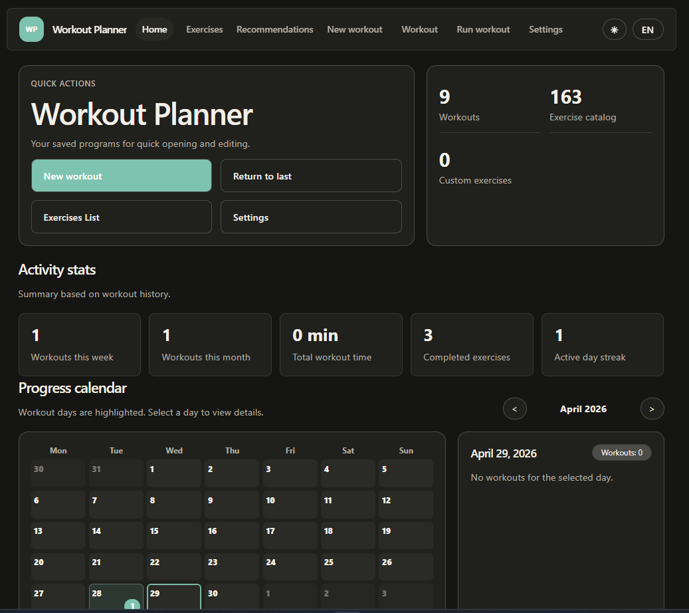

Каталог упражнений отображает встроенные и пользовательские упражнения. Пользователь может искать и фильтровать упражнения, добавлять их в избранное, открывать карточку упражнения и создавать собственные записи.

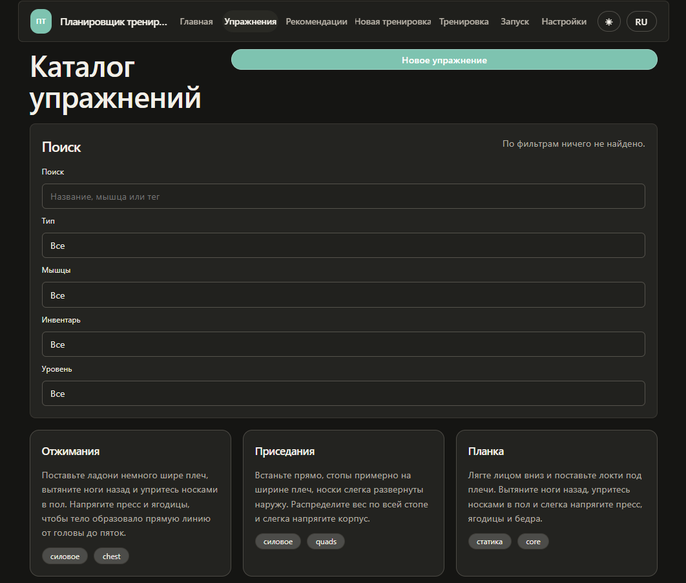

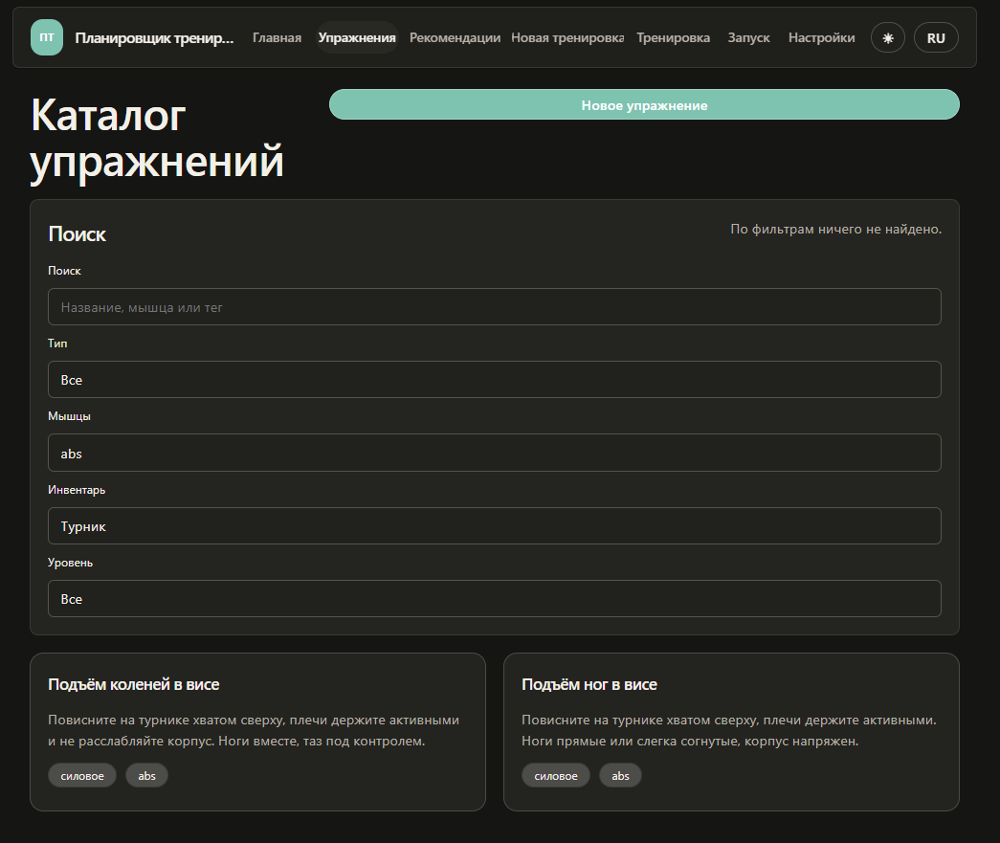

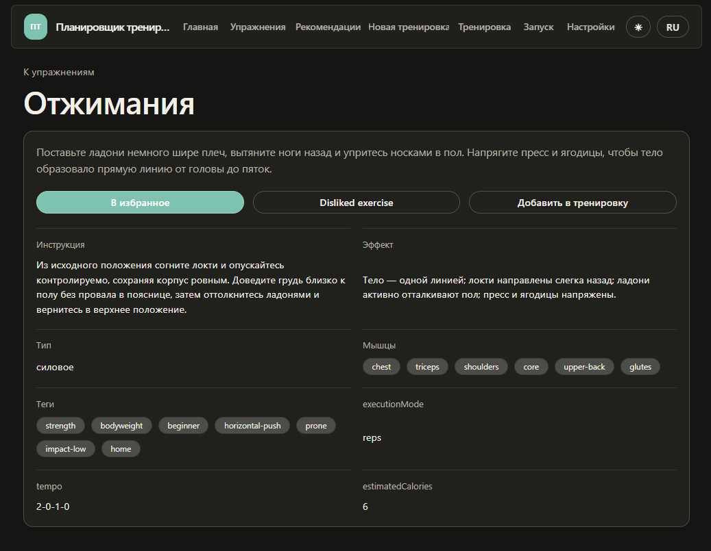

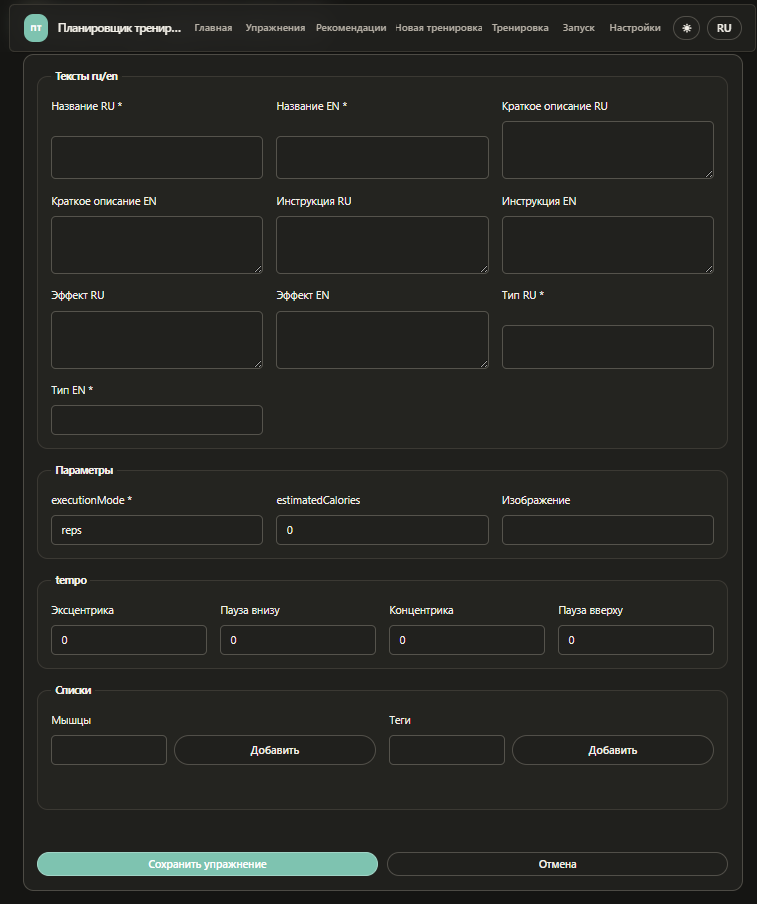

Раздел рекомендаций показывает упражнения, ранжированные под профиль пользователя. В отличие от обычного каталога, он учитывает цели, уровень подготовки, оборудование, ограничения, предпочтения, восстановление и недавнюю историю.

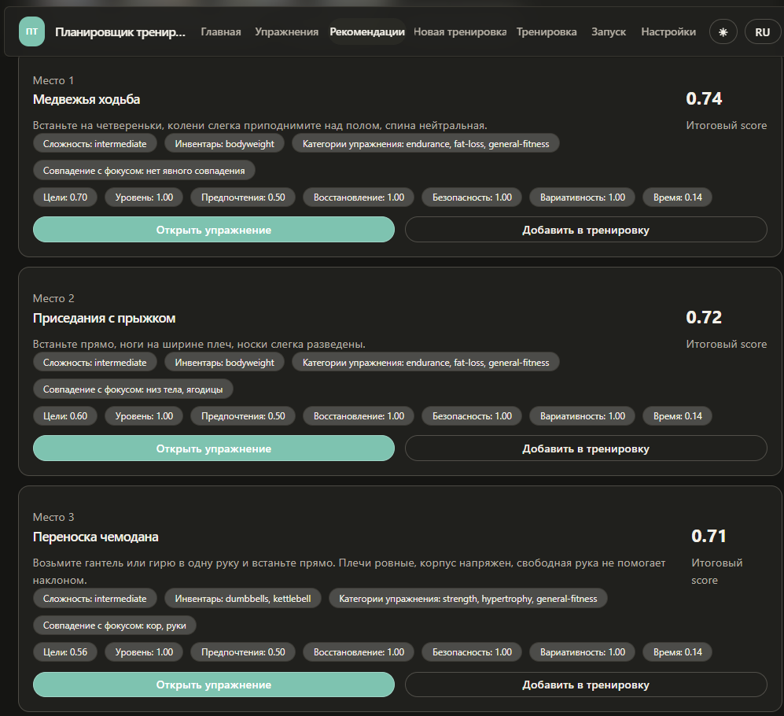

Раздел настроек объединяет несколько групп: язык, тема, плотность интерфейса, звук, громкость, пользовательские аудиофайлы, профиль, оборудование, импорт и экспорт.

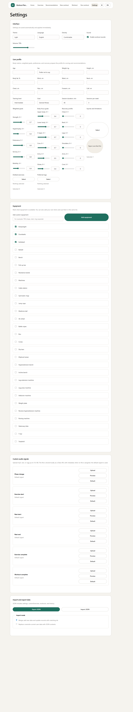

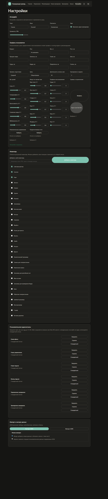

### 9.3. Стили и адаптация

Для адаптации интерфейса стили разделены по файлам: `base.css`, `layout.css`, `navigation.css`, `components.css`, `home.css`, `exercises.css`, `workouts.css`, `session.css`, `settings.css`, `calendar.css`, `responsive.css`, `variables.css` и другие. Это позволяет развивать интерфейс по областям и поддерживать отдельные CSS-модули для экранов.

## 10. Реализация конструктора тренировок

### 10.1. Доменная модель конструктора

Конструктор тренировок реализует создание и редактирование пользовательского шаблона. Тренировка состоит из упорядоченного списка элементов, каждый из которых ссылается на упражнение и содержит параметры выполнения.

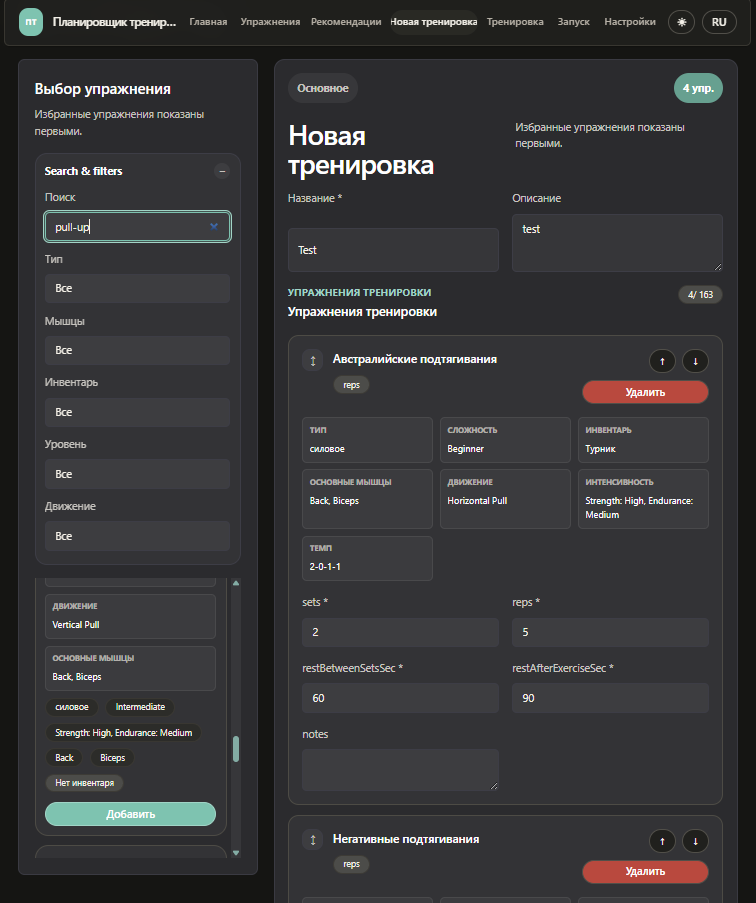

Основная доменная логика работы с тренировками находится в `js/features/workouts.js`. Модуль предоставляет функции создания пустой тренировки, создания элемента тренировки, нормализации тренировки, расчета расчетной длительности и оценки калорий.

### 10.2. Сохранение и валидация

Сохранение тренировок выполняется через `js/storage/workoutRepository.js` и публичные функции `js/storage/core.js`. Репозиторий отвечает за CRUD-операции, сортировку, поиск, дублирование и обновление записей. Перед сохранением данные проходят валидацию и санитайзеры.

В элементе тренировки поддерживаются разные сценарии выполнения:

- выполнение по повторениям через поле `reps`;
- выполнение по времени или удержание через `durationSec`;
- опциональная дистанция;
- отдых между подходами;
- отдых после упражнения;
- переопределение темпа;
- заметка к упражнению в рамках конкретной тренировки.

### 10.3. Генерация тренировки

Дополнительно в проекте реализована генерация тренировки. Модуль `js/features/workout-generation.js` строит одну тренировку по запросу пользователя. Запрос включает целевую длительность от 10 до 120 минут, тип тренировки и приоритеты целей или фокуса тела.

Генератор использует рекомендации как входной слой. Сначала упражнения фильтруются и ранжируются, затем строится шаблон слотов: разминка, основная работа, аксессорные упражнения, корпус, кондиционная работа, финишер или мобильность. Для каждого слота выбирается уникальное упражнение с учетом score, соответствия слоту, разнообразия паттернов движения и роли.

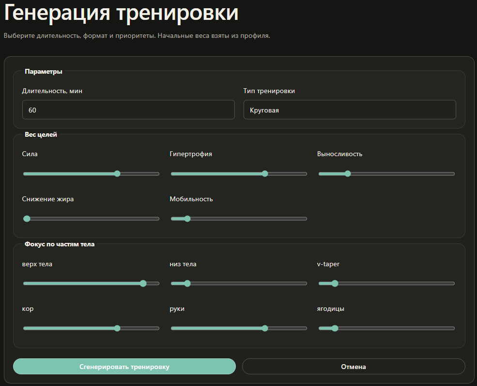

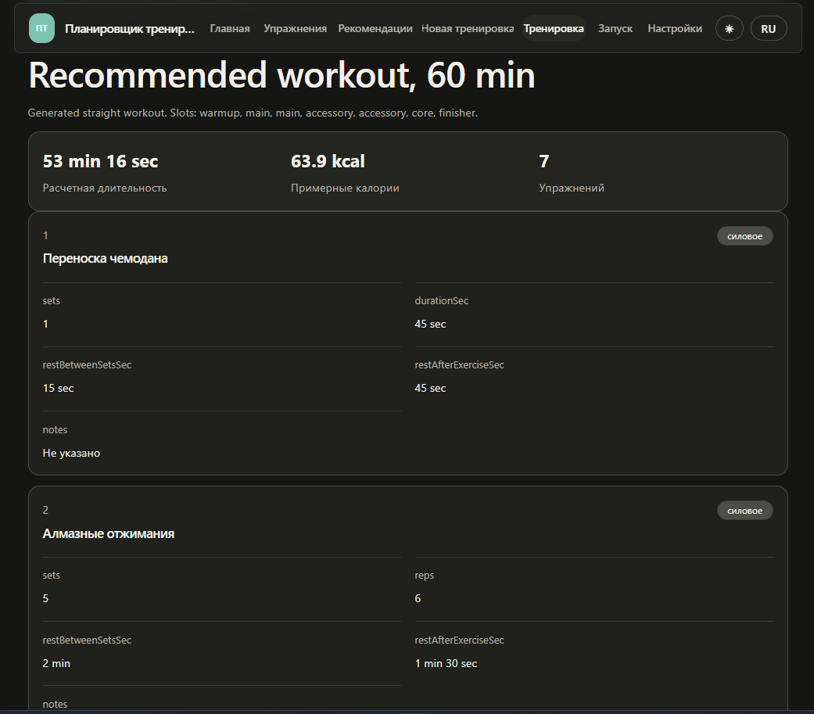

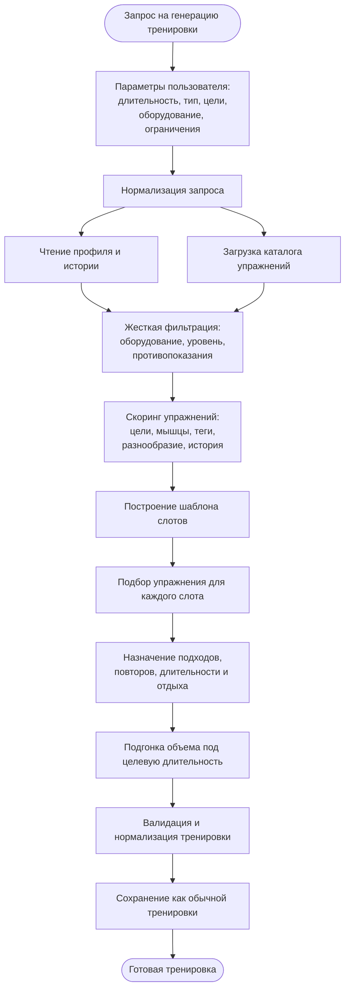
```mermaid
%% Алгоритм генерации тренировки
flowchart TD
  start([Запрос на генерацию тренировки])
  input["Параметры пользователя:\nдлительность, тип, цели,\nоборудование, ограничения"]
  normalize["Нормализация запроса"]
  profile["Чтение профиля и истории"]
  candidates["Загрузка каталога упражнений"]
  hardFilters["Жесткая фильтрация:\nоборудование, уровень,\nпротивопоказания"]
  scoring["Скоринг упражнений:\nцели, мышцы, теги,\nразнообразие, история"]
  slots["Построение шаблона слотов"]
  select["Подбор упражнения для каждого слота"]
  dosage["Назначение подходов,\nповторов, длительности и отдыха"]
  fitDuration["Подгонка объема под целевую длительность"]
  validate["Валидация и нормализация тренировки"]
  save["Сохранение как обычной тренировки"]
  result([Готовая тренировка])

  start --> input --> normalize
  normalize --> profile
  normalize --> candidates
  profile --> hardFilters
  candidates --> hardFilters
  hardFilters --> scoring --> slots --> select --> dosage
  dosage --> fitDuration --> validate --> save --> result
```

Рисунок 18 - Алгоритм генерации тренировки.

## 11. Реализация сессии тренировки и таймеров

### 11.1. Преобразование тренировки в шаги

Движок тренировочной сессии расположен в `js/session/`. Его задача - преобразовать сохраненную тренировку в последовательность исполняемых шагов и управлять прохождением этих шагов во времени.

Построение шагов выполняется функцией `buildWorkoutSteps(workout, exercises)` из `js/session/steps.js`. Она нормализует тренировку, создает карту упражнений, проходит по элементам тренировки и для каждого подхода создает шаг упражнения. Между подходами добавляются шаги отдыха `rest-between-sets`, а между упражнениями - шаги `rest-after-exercise`, если задана длительность отдыха.

Пример упрощенной структуры шагов:

```js
[
  {
    id: 'workout-item-1:set-1:exercise',
    type: 'exercise',
    phase: 'exercise',
    exerciseId: 'push-up',
    setNumber: 1,
    totalSets: 3,
    reps: 12,
    durationSec: 36
  },
  {
    id: 'workout-item-1:set-1:rest',
    type: 'rest-between-sets',
    phase: 'rest-between-sets',
    durationSec: 60
  }
]
```

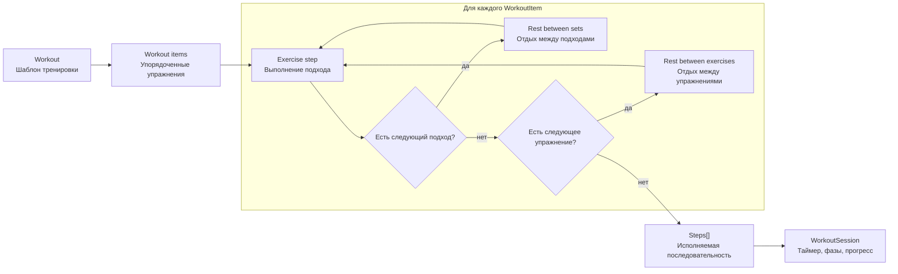
```mermaid
%% Преобразование тренировки в шаги
flowchart LR
  workout["Workout\nШаблон тренировки"]
  items["Workout items\nУпорядоченные упражнения"]

  subgraph itemLoop["Для каждого WorkoutItem"]
    exerciseStep["Exercise step\nВыполнение подхода"]
    restSets{"Есть следующий подход?"}
    restBetweenSets["Rest between sets\nОтдых между подходами"]
    restExercises{"Есть следующее упражнение?"}
    restBetweenExercises["Rest between exercises\nОтдых между упражнениями"]
  end

  steps["Steps[]\nИсполняемая последовательность"]
  session["WorkoutSession\nТаймер, фазы, прогресс"]

  workout --> items --> exerciseStep
  exerciseStep --> restSets
  restSets -- "да" --> restBetweenSets --> exerciseStep
  restSets -- "нет" --> restExercises
  restExercises -- "да" --> restBetweenExercises --> exerciseStep
  restExercises -- "нет" --> steps
  steps --> session
```

Рисунок 19 - Преобразование тренировки в исполняемые шаги.

### 11.2. Контроллер сессии

Контроллер `WorkoutSession` находится в `js/session/core.js`. Он поддерживает статусы `idle`, `running`, `paused`, `completed`, `aborted`. Основные методы контроллера: `start`, `pause`, `resume`, `skipCurrentStep`, `addTime`, `subtractTime`, `abort`, `tick`, `complete` и `getSnapshot`.

Таймер работает с интервалом 1000 мс. На каждом tick уменьшается оставшееся время текущего шага и увеличивается прошедшее время. Если оставшееся время становится равным нулю, сессия переходит к следующему шагу. Если шаги закончились, тренировка переводится в статус `completed`.

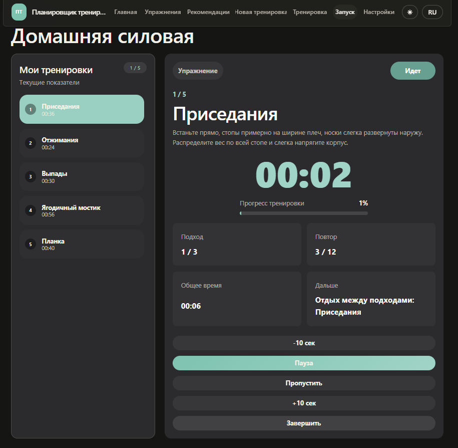

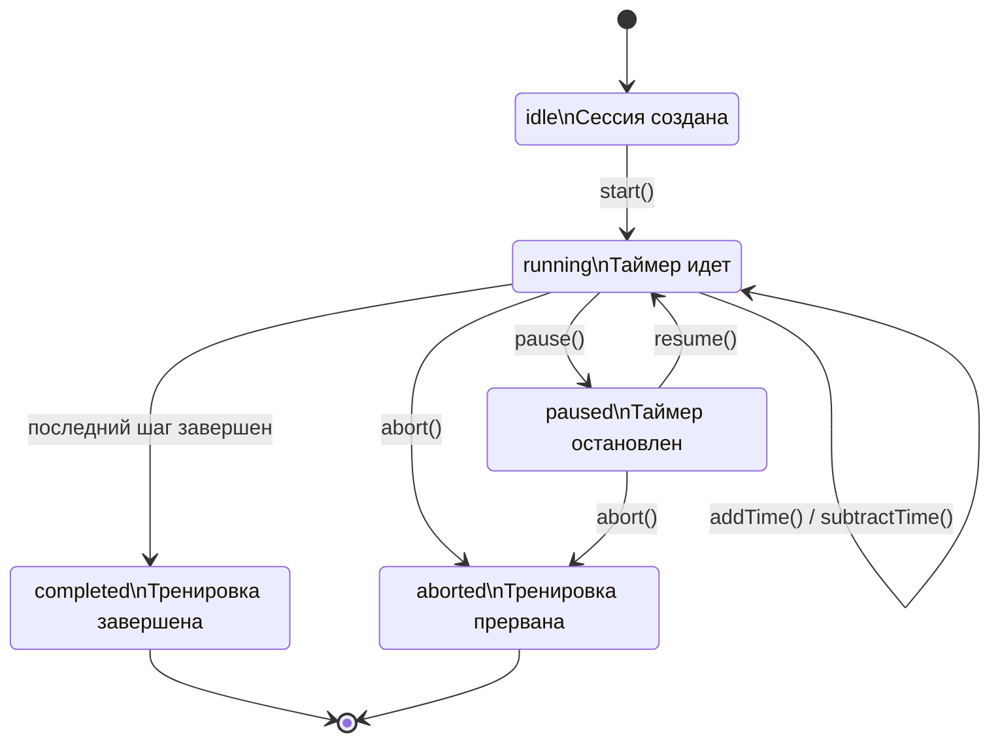
```mermaid
%% Состояния тренировочной сессии
stateDiagram-v2
  [*] --> Idle

  Idle: idle\nСессия создана
  Running: running\nТаймер идет
  Paused: paused\nТаймер остановлен
  Completed: completed\nТренировка завершена
  Aborted: aborted\nТренировка прервана

  Idle --> Running: start()
  Running --> Paused: pause()
  Paused --> Running: resume()
  Running --> Running: tick() / следующий шаг
  Running --> Completed: последний шаг завершен
  Running --> Aborted: abort()
  Paused --> Aborted: abort()
  Running --> Running: skipCurrentStep()
  Running --> Running: addTime() / subtractTime()

  Completed --> [*]
  Aborted --> [*]
```

Рисунок 21 - Диаграмма состояний тренировочной сессии.

### 11.3. Фазы и звуковые события

Фазы сессии включают `exercise`, `rest-between-sets`, `rest-between-exercises` и `finished`. Для упражнений с повторами дополнительно вычисляются фазы одного повторения: `eccentric`, `pauseBottom`, `concentric`, `pauseTop`.

Звуковые события вызываются при старте упражнения, начале отдыха, завершении отдыха, завершении упражнения, смене фазы повторения и завершении тренировки. Сигналы обрабатываются модулем `js/features/audio.js`; пользователь может отключить звук или настроить собственные аудиофайлы через настройки.

### 11.4. Snapshot-восстановление

Для восстановления активной тренировки используется `js/session/snapshot.js`. Сессия сохраняет сокращенный snapshot в `activeSession`. Сохранение происходит принудительно при важных действиях и периодически во время активной работы. Дефолтный интервал сохранения - 5000 мс.

Пример persisted snapshot:

```js
{
  version: 1,
  savedAt: '2026-04-28T10:00:00.000Z',
  status: 'paused',
  workout: { id: 'workout-1', title: 'Домашняя тренировка', items: [] },
  steps: [
    { id: 'workout-item-1:set-1:exercise', durationSec: 36 },
    { id: 'workout-item-1:set-1:rest', durationSec: 60 }
  ],
  currentStepIndex: 0,
  remainingSec: 18,
  elapsedSec: 18,
  startedAt: '2026-04-28T09:59:42.000Z'
}
```

Упрощенно восстановление выглядит так:

```js
const snapshot = getSessionSnapshot();
const session = restoreWorkoutSession(snapshot, exercises, {
  autoStartTimer: true
});
```

Восстановление возможно только для статусов `running` и `paused`. При восстановлении проверяется корректность snapshot, совпадение количества шагов и ID шагов, а также допустимость оставшегося времени. Если проверка не проходит, snapshot удаляется.

## 12. Реализация истории и прогресса

### 12.1. Сохранение истории

История тренировок реализована как отдельный раздел хранилища `history`. Это позволяет отделить прошлые факты выполнения от текущих шаблонов тренировок. Даже если пользователь изменит тренировку после выполнения, запись истории сохраняет снимок названия и данные фактической сессии.

Запись истории создается через функции `createHistoryEntry`, `createHistoryRecord`, `saveHistoryEntry` и связанные репозиторные методы. Она содержит время начала и окончания, длительность, статус, выполненные элементы, заметку, emoji-рейтинг, расчетные калории, количество выполненных упражнений и подходов.

### 12.2. Календарь и статистика

Поддерживаются статусы `completed`, `aborted` и `interrupted`. Это позволяет отличать полностью завершенные тренировки от досрочно остановленных или прерванных. Такая информация важна для календаря и статистики, потому что не все записи истории имеют одинаковое значение.

Модуль `js/features/history.js` отвечает за агрегацию истории, календарные данные, суммарную длительность и калории. На главной странице история используется для отображения статистики, активности по датам и прогресса.

Календарный сценарий основан на группировке тренировок по датам. Пользователь может видеть, в какие дни были занятия, сколько тренировок приходится на день, какие записи связаны с выбранной датой, а также заметки и оценки.

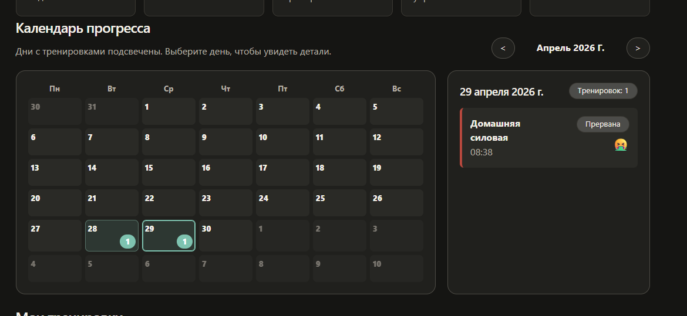

### 12.3. Использование истории в рекомендациях

История используется как сигнал для рекомендаций. Недавние выполненные упражнения и паттерны движения могут снижать оценку повторяющихся упражнений, чтобы рекомендации были разнообразнее и меньше перегружали одни и те же группы движений.

## 13. Реализация PWA и offline-режима

### 13.1. Состав PWA

PWA-часть проекта состоит из `manifest.webmanifest`, `sw.js`, регистрации service worker в `js/core/pwa.js` и скрипта генерации precache-списка `scripts/generate-precache.js`.

Manifest описывает приложение как `Workout Planner`, задает короткое имя `Workout`, режим отображения `standalone`, ориентацию `portrait-primary`, цвета, категории, иконки и shortcuts. Shortcuts позволяют быстро открыть каталог упражнений и создание тренировки.

### 13.2. Стратегия кеширования

Service worker использует кеш с ревизией в имени. В массиве `APP_SHELL` перечислены файлы, необходимые для запуска приложения: корневой путь, `index.html`, иконки, JS-модули, CSS и manifest.

```text
install
  -> open current cache
  -> cache APP_SHELL
  -> skipWaiting

activate
  -> delete old caches
  -> clients.claim

fetch GET navigation
  -> try network
  -> fallback to cached index.html

fetch GET asset
  -> try cache
  -> fallback to network
  -> save successful response
```

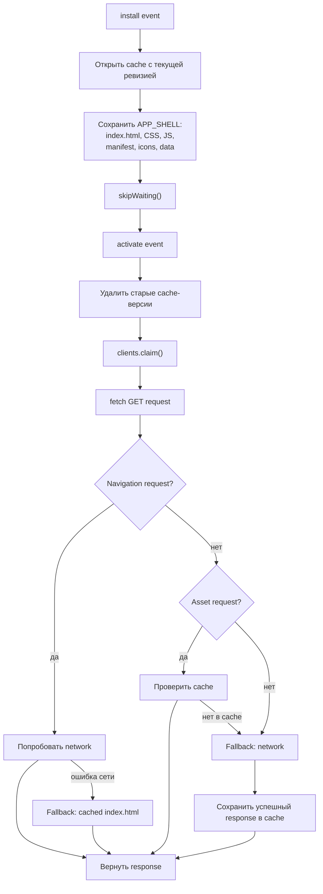
```mermaid
%% PWA cache flow
flowchart TD
  install["install event"]
  openCache["Открыть cache с текущей ревизией"]
  cacheAppShell["Сохранить APP_SHELL:\nindex.html, CSS, JS,\nmanifest, icons, data"]
  skipWaiting["skipWaiting()"]

  activate["activate event"]
  deleteOld["Удалить старые cache-версии"]
  claimClients["clients.claim()"]

  fetch["fetch GET request"]
  isNavigation{"Navigation request?"}
  networkNav["Попробовать network"]
  cachedIndex["Fallback: cached index.html"]
  isAsset{"Asset request?"}
  cacheFirst["Проверить cache"]
  networkAsset["Fallback: network"]
  saveAsset["Сохранить успешный response в cache"]
  response["Вернуть response"]

  install --> openCache --> cacheAppShell --> skipWaiting
  skipWaiting --> activate --> deleteOld --> claimClients
  claimClients --> fetch
  fetch --> isNavigation
  isNavigation -- "да" --> networkNav --> response
  networkNav -- "ошибка сети" --> cachedIndex --> response
  isNavigation -- "нет" --> isAsset
  isAsset -- "да" --> cacheFirst --> response
  cacheFirst -- "нет в cache" --> networkAsset --> saveAsset --> response
  isAsset -- "нет" --> networkAsset
```

Рисунок 23 - Схема работы PWA-кеширования.

### 13.3. Обновление precache

Precache-список не редактируется вручную как произвольный список. Для его обновления используется команда:

```bash
npm run generate:precache
```

Скрипт обновляет `APP_SHELL` и имя кеша в `sw.js`. Это важно после изменения статических импортов, CSS, manifest, иконок, `index.html` или generated exercise data. Полнота precache проверяется тестом `tests/pwa/service-worker.test.js`.


## 14. Тестирование

### 14.1. Инструменты и уровни тестирования

В проекте применяется автоматизированное тестирование на нескольких уровнях.

Jest используется для модульных и интеграционных тестов. Тесты находятся в каталоге `tests/` и включают проверки хранилища, репозиториев, записей, миграций, рекомендаций, генерации тренировок, совместимости упражнений, противопоказаний, истории, движка сессии, snapshot-восстановления, форматирования UI, селекторов, рендереров и XSS-регрессий.

Playwright используется для e2e smoke-тестов. Конфигурация находится в `playwright.config.js`, а локальный сервер запускается через `scripts/e2e-server.js`.

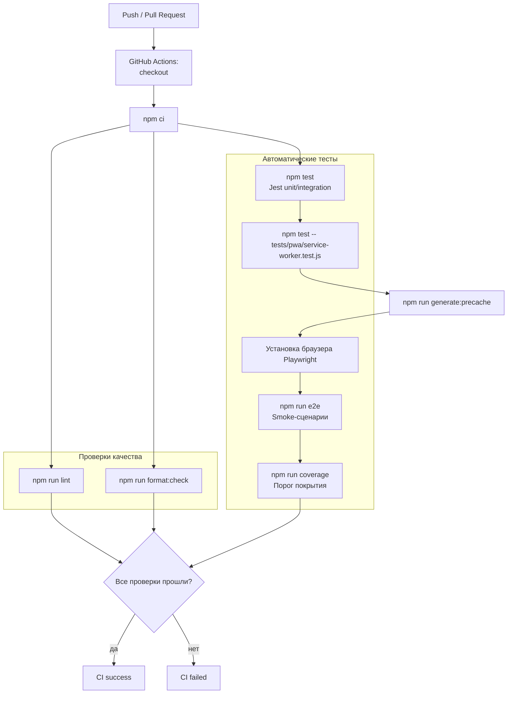
```mermaid
%% Схема тестирования и CI
flowchart TD
  push["Push / Pull Request"]
  checkout["GitHub Actions:\ncheckout"]
  install["npm ci"]

  subgraph quality["Проверки качества"]
    lint["npm run lint"]
    format["npm run format:check"]
  end

  subgraph tests["Автоматические тесты"]
    jest["npm test\nJest unit/integration"]
    pwaTest["npm test -- tests/pwa/service-worker.test.js"]
    e2eInstall["Установка браузера Playwright"]
    e2e["npm run e2e\nSmoke-сценарии"]
    coverage["npm run coverage\nПорог покрытия"]
  end

  precache["npm run generate:precache"]
  result{"Все проверки прошли?"}
  pass["CI success"]
  fail["CI failed"]

  push --> checkout --> install
  install --> lint
  install --> format
  install --> jest
  jest --> pwaTest
  pwaTest --> precache
  precache --> e2eInstall --> e2e
  e2e --> coverage
  lint --> result
  format --> result
  coverage --> result
  result -- "да" --> pass
  result -- "нет" --> fail
```

Рисунок 24 - Схема автоматизированного тестирования и CI.

### 14.2. Фактическое покрытие

Контрольный запуск `npm run coverage` показал следующие значения покрытия:

| Область | Statements | Branches | Functions | Lines |
| --- | ---: | ---: | ---: | ---: |
| All files | 80.16% | 69.03% | 86.06% | 80.10% |
| `js/features` | 83.64% | 71.95% | 86.80% | 83.69% |
| `js/session` | 66.44% | 59.70% | 78.74% | 65.87% |
| `js/storage` | 86.48% | 72.45% | 89.63% | 86.84% |

В `package.json` задан глобальный порог 70% по statements, functions и lines. Branch coverage отдельно не включен в порог, но отображается в отчете и полезен для анализа качества проверок.


### 14.3. Примеры тестовых файлов

| Файл | Назначение |
| --- | --- |
| `tests/storage/core.test.js` | Проверка core-фасада хранилища. |
| `tests/storage/repositories.test.js` | Проверка репозиториев. |
| `tests/storage/records.test.js` | Проверка фабрик и санитайзеров записей. |
| `tests/storage/migrations.test.js` | Проверка миграций store. |
| `tests/features/recommendations.test.js` | Проверка фильтрации и скоринга рекомендаций. |
| `tests/features/workout-generation.test.js` | Проверка генерации тренировки. |
| `tests/features/exercise-compatibility.test.js` | Проверка совместимости упражнений. |
| `tests/features/history.test.js` | Проверка истории и агрегатов. |
| `tests/session/core.test.js` | Проверка `WorkoutSession`. |
| `tests/session/steps.test.js` | Проверка построения шагов тренировки. |
| `tests/session/snapshot.test.js` | Проверка snapshot-восстановления. |
| `tests/pwa/service-worker.test.js` | Проверка service worker и precache. |
| `tests/security/xss-regression.test.js` | Проверка XSS-регрессий. |
| `tests/e2e/smoke.spec.js` | Базовые e2e smoke-сценарии. |

### 14.4. CI и команды проверки

Качество кода поддерживается ESLint и Prettier. CI настроен через GitHub Actions и выполняет установку зависимостей, lint, проверку форматирования, Jest-тесты, установку браузера Playwright, e2e-тесты, генерацию precache, PWA-тест и coverage.

Основные команды проверки:

```bash
npm run lint
npm run format:check
npm test
npm run e2e
npm run generate:precache
npm test -- tests/pwa/service-worker.test.js
npm run coverage
```

## 15. Безопасность и ограничения

### 15.1. Модель безопасности

Так как приложение не использует backend и хранит данные локально, основная модель безопасности связана с браузером, origin и корректной обработкой пользовательского ввода.

Пользовательские данные не отправляются на сервер приложением. Они остаются в `localStorage` текущего браузера и домена. Это снижает риски утечки через backend, но создает другие ограничения: данные могут быть потеряны при очистке данных сайта, недоступны на другом устройстве без экспорта и зависят от origin.

### 15.2. Валидация и санитайзинг

Импорт данных валидируется. Приложение проверяет:

- корневой элемент JSON должен быть объектом;
- должен присутствовать хотя бы один известный раздел;
- неизвестные разделы отклоняются;
- `settings`, `profile` и `equipment` должны быть объектами;
- `customExercises`, `workouts`, `history` и legacy-`favorites` должны быть массивами;
- элементы массивов сущностей должны быть объектами;
- `customAudio` должен содержать только известные события;
- пользовательское аудио должно быть строкой Data URL или объектом с `dataUrl`.

Санитайзеры дополнительно приводят данные к безопасной форме. Например:

- отрицательные значения подходов, отдыха и длительности приводятся к допустимым диапазонам;
- неизвестные значения `theme`, `language`, `density` и `calendarViewMode` заменяются дефолтами;
- поврежденные даты заменяются безопасными ISO-датами;
- невалидная активная сессия удаляется;
- custom audio принимается только как `data:audio/...;base64,...`;
- списки строк очищаются от дублей и пустых значений.

### 15.3. XSS и пользовательские данные

В проекте есть тесты XSS-регрессий. Это важно, потому что приложение работает с пользовательскими названиями, описаниями, заметками и импортируемыми данными. UI должен безопасно отображать пользовательские значения и не превращать их в исполняемый код.


### 15.4. Ограничения проекта

- приложение не является медицинским сервисом и не заменяет консультацию тренера или врача;
- рекомендации основаны на локальных эвристиках и данных профиля, а не на клинической модели;
- расчет калорий является приблизительным;
- нет серверной синхронизации между устройствами;
- нет учетных записей и разграничения пользователей;
- `localStorage` имеет ограничения объема и может быть очищен браузером;
- офлайн-режим доступен только после первого успешного запуска;
- service worker требует `localhost`, `127.0.0.1` или HTTPS;
- пользовательские аудиофайлы в Data URL увеличивают объем локального хранилища.

## 16. Перспективы развития

Перспективы развития сгруппированы по приоритету и трудоемкости.

### 16.1. Быстрые улучшения

1. Добавить публичное демо и реальные скриншоты.
2. Расширить документацию пользовательскими сценариями.
3. Улучшить объяснения рекомендаций в UI на основе уже доступных `reasons`, `matchedSignals` и `penalties`.
4. Добавить предупреждения о необходимости экспорта перед очисткой данных сайта.
5. Расширить ручной чек-лист PWA-проверки.

### 16.2. Средние инициативы

1. Улучшить мобильный UX активной тренировки.
2. Расширить каталог упражнений и качество метаданных.
3. Добавить более подробные графики прогресса.
4. Улучшить сценарии резервного копирования и восстановления данных.
5. Расширить настройки генератора тренировки.

### 16.3. Крупные инициативы

1. Реализовать сложные суперсеты и составные тренировочные блоки.
2. Добавить детальный учет веса, инвентаря и прогрессии нагрузки.
3. Реализовать продвинутый аудиоредактор.
4. Рассмотреть опциональную синхронизацию между устройствами без нарушения local-first модели.
5. Развить рекомендации до более сложной системы периодизации и восстановления.

## 17. Заключение

В результате работы было разработано статическое PWA-приложение `Workout Planner / workout-tracker` для планирования, проведения и учета персональных тренировок. Проект реализует основные требования технического задания: каталог упражнений, пользовательские упражнения, конструктор тренировок, запуск пошаговой сессии, таймеры, звуковые сигналы, сохранение истории, календарь активности, локальное хранение данных, импорт и экспорт, локализацию, темы оформления и восстановление активной тренировки.

Архитектура проекта построена на модульном разделении кода. Доменная логика вынесена в `features`, хранилище - в `storage`, движок тренировки - в `session`, рендеринг - в `pages`, а обработчики интерфейса - в `ui`. Такое разделение делает проект поддерживаемым и позволяет тестировать ключевые части независимо от UI.

Важной частью работы стала реализация local-first хранилища. Данные сохраняются в `localStorage`, проходят нормализацию и миграции, могут экспортироваться и импортироваться в JSON. Это обеспечивает автономность приложения и контроль пользователя над данными.

Отдельно реализован движок тренировочной сессии. Он преобразует тренировку в исполняемые шаги, управляет таймером, фазами, паузой, пропуском, изменением времени, завершением и snapshot-восстановлением. Это делает приложение пригодным не только для планирования, но и для практического проведения тренировки.

PWA-реализация позволяет запускать приложение офлайн после первого открытия. Service worker кеширует app shell, а тесты проверяют полноту precache-списка. Это повышает надежность приложения в условиях нестабильного соединения.

Проект также включает систему тестирования и качества: Jest, Playwright, ESLint, Prettier и GitHub Actions. Наличие тестов для хранилища, рекомендаций, сессии, PWA и e2e-сценариев подтверждает инженерную проработку решения.

Таким образом, поставленная цель достигнута: создано работоспособное веб-приложение для персонального планирования тренировок с локальным хранением, офлайн-возможностями, модульной архитектурой и расширяемой моделью данных. Проект может использоваться как основа для дальнейшего развития фитнес-приложения и как демонстрация практических навыков frontend-разработки.
